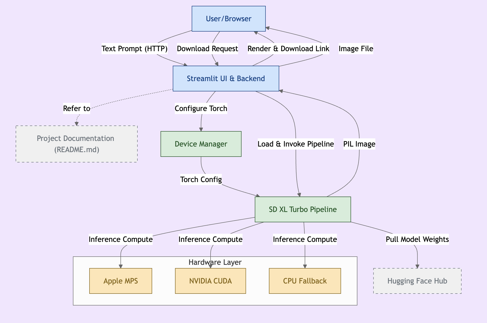

# Text-to-Image Generation with SDXL Turbo 

This project is a **Streamlit-based web application** that uses **Stable Diffusion XL Turbo** to generate images from text prompts. It automatically detects the best device for inference (MPS for Apple Silicon, CUDA for GPUs, or CPU as a fallback).

## Features
- Generate high-quality images from text prompts using **Stable Diffusion XL Turbo**.
- Works on **Mac (M1/M2), NVIDIA GPUs, and CPUs**.
- Streamlit-powered UI for easy interaction.
- Download the generated image with a single click.

## Installation
### 1. Clone the Repository
```sh
git clone https://github.com/yourusername/your-repo-name.git
cd your-repo-name
```

### 2. Create a Virtual Environment (Optional but Recommended)
```sh
python -m venv venv
source venv/bin/activate  # On macOS/Linux
venv\Scripts\activate    # On Windows
```

### 3. Install Dependencies
```sh
pip install -r requirements.txt
```

## Running the Application
```sh
streamlit run main.py
```
After running the command, the app will be available at:
```
http://localhost:8501
```

## Requirements
- Python 3.8+
- Streamlit
- Diffusers
- Torch (with MPS support for Mac or CUDA for NVIDIA GPUs)
- Pillow

## Device Compatibility
- **Mac (M1/M2)** → Uses **MPS** for acceleration
- **NVIDIA GPU** → Uses **CUDA**
- **CPU-only devices** → Runs in fallback mode


## Example Prompt
Try entering this prompt in the app:
```
Baby in car
```


## Diagram

